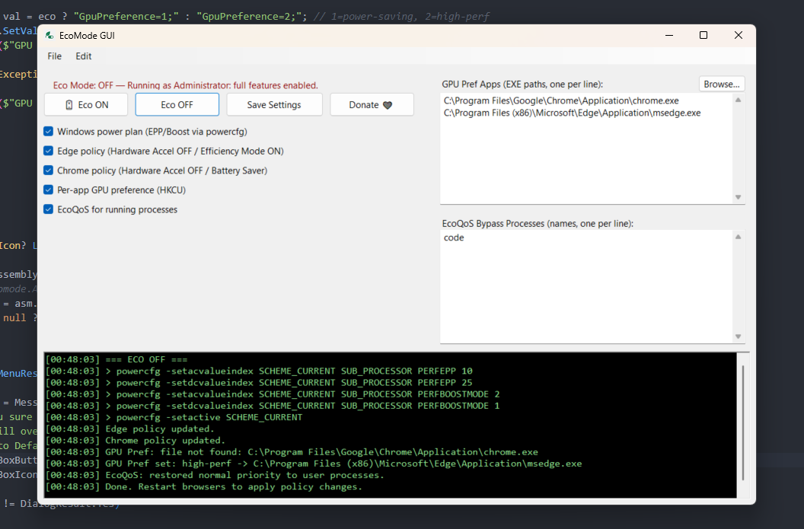

# EcoMode

⚡ **EcoMode** is a lightweight Windows utility that helps reduce power consumption and improve efficiency by applying smart system tweaks and process management rules.



## ✨ Features

* **One-click Eco Mode toggle**: switch between *Eco ON* (power-saving) and *Eco OFF* (performance) instantly.
* **Windows power plan tweaks**: automatically adjusts *Energy Performance Preference (EPP)* and *Boost* settings.
* **Browser policies**: applies registry policies for Microsoft Edge and Google Chrome (hardware acceleration off, battery saver/efficiency mode on).
* **Per-app GPU preferences**: configure applications to use *integrated GPU (power-saving)* or *discrete GPU (performance)*.
* **EcoQoS (Quality of Service)**: throttle background processes while keeping the active foreground app boosted.
* **Configurable bypass list**: define which processes should never be throttled.
* **Tray support**: runs in the background, minimizes to system tray instead of closing.
* **Import / export / reset profiles**: easily back up or share your configuration.
* **Activity log**: console-like log viewer with color-coded log levels.

## 📥 Installation

1. Download the latest installer from the [Releases](../../releases) page.
2. Run the setup — EcoMode will be installed with Start Menu and system tray support.
3. Launch EcoMode from the Start Menu or tray icon.

*(Installer built with Inno Setup — no external dependencies needed.)*

## 🚀 Usage

* Click **🔋 Eco ON** to enable Eco Mode.
* Use the **check boxes** to control which tweaks are applied (Power Plan, Edge/Chrome policies, GPU prefs, EcoQoS).
* Use **Browse…** to add apps for GPU preference management.
* Add process names to the **Bypass list** if they should never be throttled.
* Right-click the **tray icon** for quick Save / Quit options.

## 🛠 Tech

* **C# (.NET WinForms)**
* **P/Invoke (Win32 APIs)** for EcoQoS and power throttling
* **Inno Setup** for installer packaging

## Build and Run (development)

```
dotnet build
dotnet run
```

## Deployment

```
# if you want to rely on user's .NET Desktop Runtime (smaller):
dotnet publish -c Release -r win-x64 --self-contained false

# OR ship everything (bigger, no runtime needed):
dotnet publish -c Release -r win-x64 --self-contained true /p:PublishSingleFile=true /p:IncludeNativeLibrariesForSelfExtract=true
```

..then build it with Inno Setup Compiler.

## Code signing

Sign your binaries with a code signing certificate to ensure integrity and authenticity.

```
signtool.exe sign /f "path\to\your\certificate.pfx" /p "your_certificate_password" EcoModeSetup.exe
```

## Notes & tweaks

Tuning values: EPP/Boost numbers are conservative defaults; adjust in ApplyPowerPlan.

## 📜 License

This project is licensed under the [CC BY-NC-ND 4.0 License](LICENSE).

You are free to share the software for non-commercial use **as-is** with attribution.  
You may not modify, rebrand, or use the name **EcoMode** for derivative works.  
